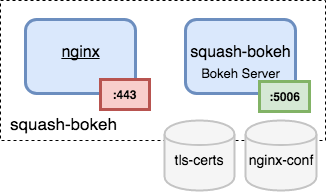

# squash-bokeh
SQuaSH bokeh microservice



The SQuaSH bokeh apps run in the [bokeh docker container](Dockerfile) which uses nginx as reverse proxy. There are mount points to store the TLS certificates and nginx specific configuration. 

## Requirements 

`squash-bokeh` requires the [squash-api](https://github.com/lsst-sqre/squash-api) microservice deployed.

### Kubernetes deployment

Clone this repo and deploy the `squash-bokeh` microservice using:

```
  TAG=latest make deployment
```

get the external IP address for the service with:
```
  kubectl get service squash-bokeh
```

NOTE: if using `minikube` make the deployment using:

```
  MINIKUBE=true TAG=latest make deployment
```

and open the service with: 

```
  minikube service --https squash-bokeh
```

### Debugging

You can inspect the deployment using:

```
  kubectl describe deployment squash-bokeh
```

and view the `nginx` and `bokeh` container logs using:

```
  kubectl logs deployment/squash-bokeh nginx
  kubectl logs deployment/squash-bokeh bokeh
```

Run an interactive shell inside the `bokeh` container using:

```
  kubectl exec <TAB>  --stdin --tty -c bokeh /bin/sh
```

### Rolling out updates

Check the update history with:

```
  kubectl rollout history deployment squash-bokeh
```

Modify the `squash-bokeh` image and then apply the new configuration for the kubernetes deployment:
  
```
  TAG=latest make build push update
```

Check the deployment changes:

```
  kubectl describe deployments squash-bokeh
```

### Scaling up the squash-bokeh microservice

Use the `kubectl get replicasets` command to view the current set of replicas.
```
  kubectl get replicasets
```

Use the `kubectl scale` command to scale the `squash-bokeh` deployment:

```
  kubectl scale deployments squash-bokeh --replicas=3
```

or change the `squash-bokeh-deployment.yaml` configuration file and apply the new configuration:

```
  kubectl apply -f squash-bokeh-deployment.yaml
```

Check the deployment changes:

```
  kubectl describe deployments squash-bokeh
  kubectl get pods
  kubectl get replicasets
```

## Development workflow


You can install the dependencies and run `squash-bokeh` locally for development

1. Install the software dependencies
```
git clone  https://github.com/lsst-sqre/squash-bokeh.git

cd squash-bokeh

virtualenv env -p python3
source env/bin/activate
pip install -r requirements.txt
```

2. Run the `squash-bokeh` 

NOTE: see instructions on how to run the [squash-api](https://github.com/lsst-sqre/squash-api)
 which is required by `squash-bokeh`

```
export SQUASH_API_URL=<squash-api url>  # e.g the one from squash-api deployment
bokeh serve --log-level debug app/<name of the bokeh app you want to run>
```

The `squash-bokeh` will run at `http://localhost:5006`. 

